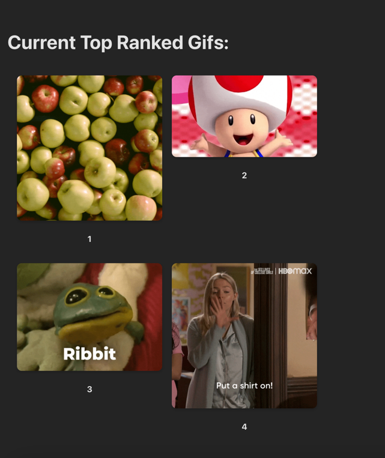

# Giphy Cache Frontend

#### Front end client for Gif Search

#### Install And Run Instructions
First follow giphy-cache-api install instructions at
https://github.com/Fargoi5/giphy-cache?tab=readme-ov-file#setup

With Node and Npm installed run from root
```
npm install
npm run dev
```

The home page:   
  

Search for your favorite Gifs:    
  

See the most popular Gifs from the rankings:   

